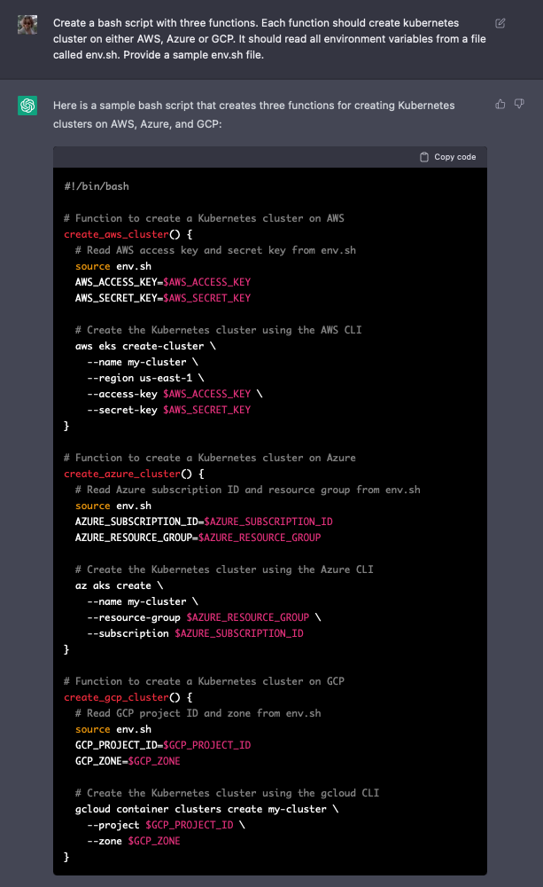
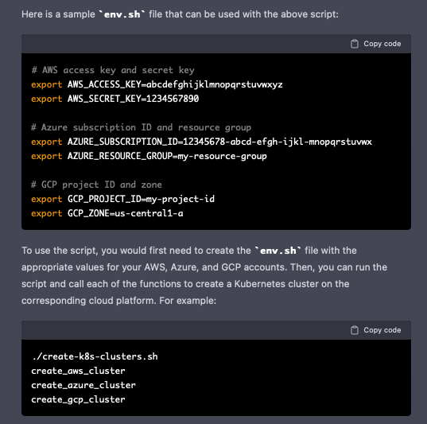
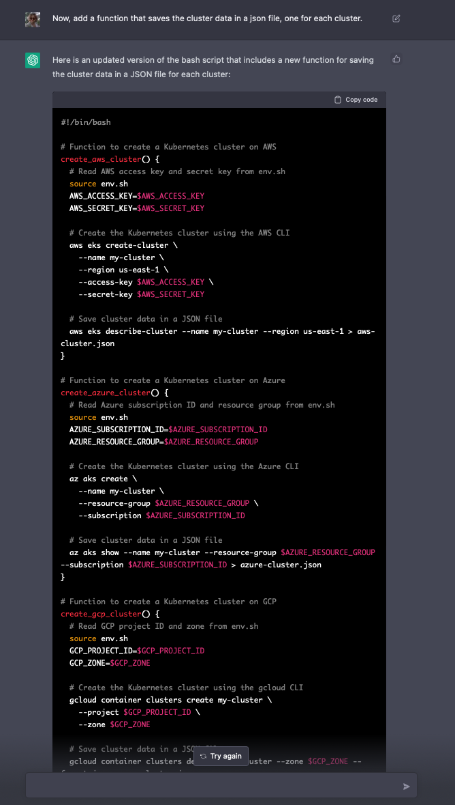
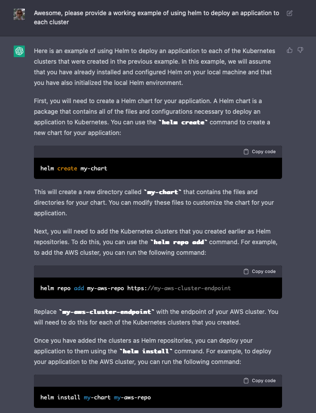
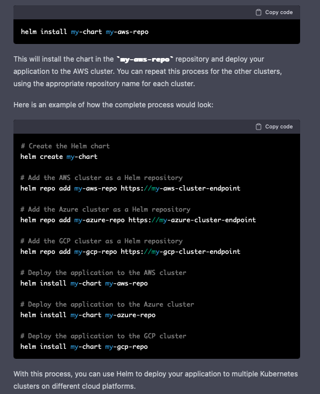

# Example ChatGPT Prompts

A GPT-3 prompt is a set of instructions or information that is provided to the GPT-3 model to guide it in generating text. The prompt typically includes a prompt string and other details that help the model understand the context and content of the text that it is generating. The prompt can be used to specify the topic, style, and tone of the generated text, as well as other parameters that influence the model's output.

## Prompting to Write a bash Script

#### Write a bash script
```console
Create a bash script with three functions. Each function should create kubernetes cluster on either AWS, 
Azure or GCP. It should read all environment variables from a file called env.sh. Provide a sample env.sh file.  
```
Results




Here's an example of asking the AI to extend the program and add a feature.
```console
Now, add a function that saves the cluster data in a json file, one for each cluster. 
```
Results



#### Helm Deploy an Application 

Next, we'll want to deploy an application to each cluster. I've chosen to use helm to do that and asked the AI to assist.

```console
Provide a working example of using helm to deploy an application to each cluster.  
```

Results



#### Add a Project README
```console
Great, now please write a README markdown file which describes this project, how to use it and include any dependencies that are needed to run it. Please include the markdown tags.
```

## Application Deployment Automation

#### Create Deployment Manifests
```console
Write 3 simple kubernetes manifests for an app called pool-side-00. One for a deployment, one for a 
service and one for ingress. Explain what each manifest does and provide example command usage. 
```

#### Write a Concourse Pipeline 
```console
Write a concourse pipeline that will deploy these three manifests from a git repository. Manifests are located
in the yaml directory (https://github.com/jmcdice/pool-side-00/yaml/). Have the pipeline post to a slack
channel called #pool-side-dev to let the team know when the application has been deployed. The pipeline should 
trigger on commits to the repository, but only on the dev branch. Include the fly command needed to deploy.
```

#### Add a Project README 
```console
Write a README file which describes this project.
 - Please add both a manual and concourse based deployment instructions.
 ```

## Customize a Helm Chart and Deploy 

#### Helm deploy cert-manager with letsencrypt
```console
- Can you show me what a values.yaml file would look like for a cert-manager helm deployment that includes using letsencrypt for both prod and staging? 
- Please include the issuer section and configure ACME HTTP01
- Can you update that to use contour as the ingress? 
- Oh, let's an ingress hostname for my cluster, call it japp-00.joecool.cc. 
- Ok, can you generate the helm command that I need to deploy that chart with that updated values.yaml file? 
- Can you provide a couple of example commands I can run to validate that it's been properly installed? 
- Awesome, now please put all that into a README file I can add to my new git repository. 
```

## Write an API Client

#### Pivotal Tracker API client
```console
I'm going to write a bash library that can talk to the Pivotal Tracker API. 
The first function should be able to create a new project in tracker. 
It should ask for a project name and return the project id. 

- Perfect, now let's add a function that will add an epic to my project. It should take a project id 
  as input and ask the user for an epic name.  

- Now, let's add a function to delete a project. Should take a project ID as input and ask the user
  for confirmation before deleteing the project.
```

## Longform Business Writing Examples

#### Platform Engineering Lesson Plan
```console
- Write a syllabus for a semester-long platform engineering class that includes devops and sample applications.
- Write a "Week 1: Introduction to platform engineering" lesson plan for this course. 
- Write a 1 hour "Week 2: Containerization and orchestration" lesson plan for this course.
```

#### Introduction to bash scripting
```console
- Write syllabus for a class which does an introduction to bash programming.
- Write a Week 1: lesson plan for this course and include an example script to introduce to students in week 1. 
- Write an example script to introduce to students in week 2 which builds on the script introduced in week 1. 
- Great, now do one for week 3, building on the first two. 
- Can you supply git commands so that I can add each of those scripts to a git repository? 
- Write a README markdown file that represents the course work so far. 
```

#### Create a Statement of Work
```console
Write an agile/XP statement of work for a 4 week platform services engagement. We will be deploying kubernetes clusters to 3 regions
in Google cloud. Each data center will have a prod and non-prod cluster. Along with deploying clusters, we'll be automating application 
deployments to these clusters via CI/CD pipelines. We'll be pairing with the customer to enable them on the process.
```

## Notes
It hit the per-cell limit on output length. All you have to do is ask it to keep going:
- Continue from the last sentence beginning "..."

